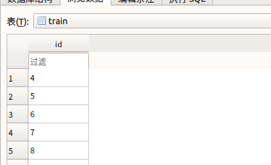
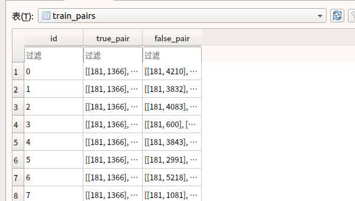

# 数据分割
## 说明
这里将会介绍如何把数据从之前的三个表里面创建train，Validation，test三个表，以及对应的pair表

## 具体分析

在main函数进行了这个调用，主要分割过程在
create_pairs
```python
 # --split -db aa
        print("Splitting data and generating epoch pairs")
        print(split_configuration(args.db, args.val_size, args.test_size, args.epochs)) #输出
        splitter = DataSplitter.DataSplitter(args.db)#初始化
        # 默认是百分之60训练集，20%训练集，20%验证集
        # 初始化，重置了一些表，添加了train，test，validation表的索引
        splitter.split_data(args.val_size, args.test_size)#val_size验证集大小，测试集大小 是个小数表示百分比

        splitter.create_pairs(args.epochs)
```

在create_pairs函数里
创建pair表，为train_pairs创建了25个epoch
validation_pairs和test_pairs创建一个
关键函数为
create_epoch_pairs


找到相似的图，然后把它们添加到数据库，如何才会被认为相似在select_similar_cfg函数中被定义
```python
    def create_epoch_pairs(self, epoch_number, pairs_table,id_table):#pairs_table和id_table是一对例（'train_pairs','train'）
        #下面的注释中以传入的pairs_table为train_pairs为例
        random.seed = epoch_number#epoch_number表示第几个epoch

        conn = sqlite3.connect(self.db_name)
        cur = conn.cursor()
        ids = cur.execute("SELECT id FROM "+id_table).fetchall()#从train里面拿到id
        ids = [i[0] for i in ids]#ids变成一个列表，每个元素为一个id
        id_set = set(ids)#列表变为集合
        true_pair = []
        false_pair = []

        for my_id in tqdm(ids):#tqdm显示进度条  ids来自train表
            q = cur.execute('SELECT project, file_name, function_name FROM functions WHERE id =?', (my_id,))
            #从function表取出对应id的信息project, file_name, function_name
            cfg_0_provenance = q.fetchone()
            #对应的项目名，文件名，函数名相同就认为相似
            id_sim = DataSplitter.select_similar_cfg(my_id, cfg_0_provenance, id_set, cur) #id,(project,file_name,function_name,id(train)集合)
            #随机在train（train表是一个例子）表中随机选出来一个id，这个id对应条目和cfg_0_provenance不相等
            id_dissim = DataSplitter.select_dissimilar_cfg(ids, cfg_0_provenance, cur)
            if id_sim is not None and id_dissim is not None:#添加到列表
                true_pair.append((my_id, id_sim))
                false_pair.append((my_id, id_dissim))

        true_pair = str(json.dumps(true_pair))#整个格式化为字符串
        false_pair = str(json.dumps(false_pair))

        cur.execute("INSERT INTO {} VALUES (?,?,?)".format(pairs_table), (epoch_number, true_pair, false_pair))#放入数据库
        conn.commit()
        conn.close()
```
这里定义了什么养的图相似

从train表里面找一个id_train，再从function表里面找到所有和id_train条目有相同项目名，文件名，以及函数名条目的id列表，这个id列表里面的元素要满足1.在train表里面，跟id_train不相等。满足上面条件的id列表里的id被认为跟原来的相似，将会被保存到数据库
```python
    def select_similar_cfg(id, provenance, ids, cursor):#选择相似cfg
        # #id,(project,file_name,function_name,id(train)集合)
        q1 = cursor.execute('SELECT id FROM functions WHERE project=? AND file_name=? and function_name=?', provenance)#从functions表找到对应条目id
        candidates = [i[0] for i in q1.fetchall() if (i[0] != id and i[0] in ids)]
        #在function里面找到和train里面project，file_name,function_name都相同的条目对应的id：这个id需要满足1.在train里面 2.跟原来那个train表里的id不相等
        #变量含义说明 id：train表里面一个id条目   i[0]：从function表里面选出来的所有的跟id变量有相同路径的id条目
        #也就是找到对应的条目是通过相同项目名，文件名，函数名来实现的
        if len(candidates) == 0:
            return None
        id_similar = random.choice(candidates)
        return id_similar

```

完成之后成为这样，train表里面只有id




