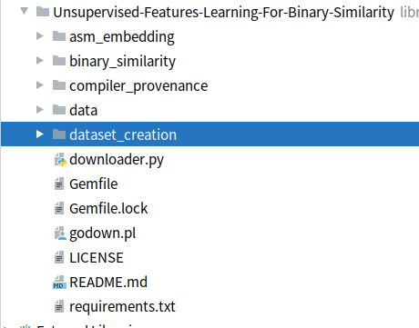
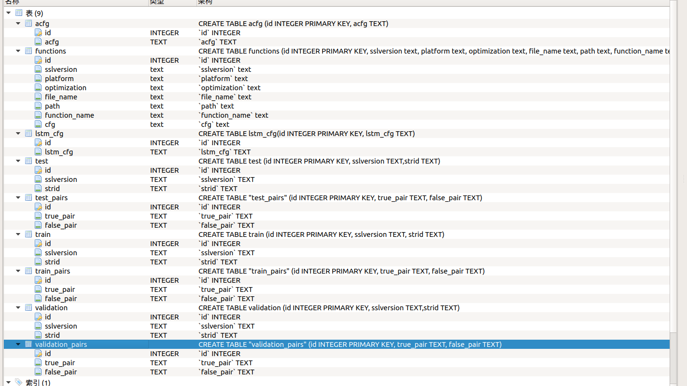
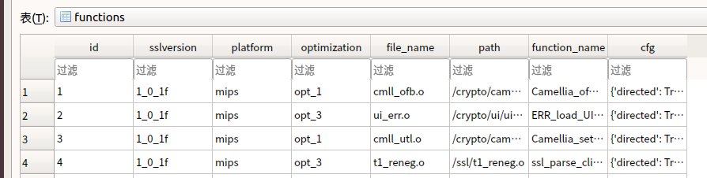
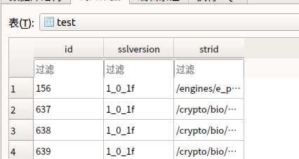
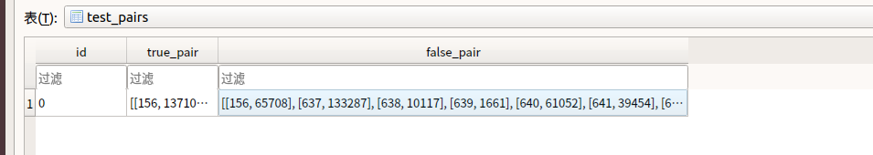
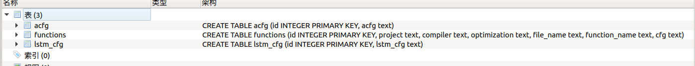
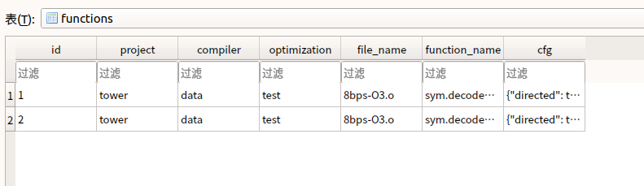
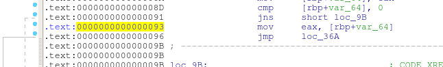
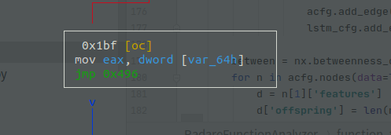

# 数据收集

## 说明
这是对https://github.com/lucamassarelli/Unsupervised-Features-Learning-For-Binary-Similarity

项目的分析，这里只是完成对数据收集部分（dataset_creation目录）的分析

里面主要内容是使用radare提供的python接口分析二进制文件。

radare同ida相比更加方便
- 提供了python接口，调用方便
- 块的内容以json串的形式输出，不像ida需要记住一大堆api。

## 目录分析


asm_embedding :汇编嵌入，存放从指令到向量的过程转化的代码。
binary_similarity:二进制相似性
compiler_provenance:编译器来源
data:存放数据集
dataset_creation:创建数据集
downloader.py: 下载数据集


分析dataset_creation下的文件
BlockFeaturesExtractor  块特征提取
DatabaseFactory  数据库工厂(应该是跟数据库有关的一个库)
ExperimentUtil     实验,应该是测试的主函数
DataSplit   数据分割
FunctionAnalyzerRadare 用radare分析函数


## 二进制相似
- OpenSSL_dataset: It includes two version of OpenSSL libraries compiled for X86 and ARM with gcc with optimizations from 0 to 3. It has been used for binary similarity task. To download it:
```python
python downloader.py -op
```
下载的文件：`openSSL_dataset.tar.bz2`
然后下载程序对文件进行了解压得到文件
`OpenSSL_dataset.db`

### acfg表

acfg和lstm_cfg结构相似，test和train相似，test_pairs与train_pair，validation_pair相似.

platform平台      optimization优化     strid大步走

acfg里面的数据为
id从1开始
```
{"directed": true, "graph": [], "nodes": [{"features": {"arith": 3, "constant": [-16, 0, 0], "string": [], "transfer": 4, "instruction": 9, "betweenness": 0.0, "call": 1, "offspring": 1}, "id": 4194304}, {"features": {"arith": 1, "constant": [16], "string": [], "transfer": 2, "instruction": 4, "betweenness": 0.0, "call": 0, "offspring": 0}, "id": 4194340}], "adjacency": [[{"id": 4194340}], []], "multigraph": false}
directed表示有向图无向图 ，graph，nodes这些是每个函数一个，nodes是块的集合。
nodes结构：arith算数指令，constant常量（这里是怎么表示的？？），string字符串，transfer跳转，instruction指令，betweenness重要程度被多少地方用到，call指令，offspring后面的块，id这个块的标识（这里用块的起始地址），adjacency邻接的块。

```


### functions表

id，ssl版本，架构，optimization优化等级，被编译成的\.o文件名这里是使用\.o来进行训练的，path文件路径（两个文件路径，文件名，函数名相同就被认为两个函数相似），function_name函数名，cfg（具体内容举例如下，其中asm表示一个块中包含的二进制指令，label里面是块对应的汇编指令）

```
{'directed': True, 'graph': [], 'nodes': [{'id': 4194304L, 'asm': 'g\xbd\xff\xf0\xff\xbf\x00\x08\xff\xbc\x00\x00<\x1c\x00\x00\x03\x99\xe0-g\x9c\x00\x00\xdf\x99\x00\x00\x03 \xf8\t\xdf\x8a\x00\x00', 'label': '0x400000:\tdaddiu\t$sp, $sp, -0x10\n0x400004:\tsd\t$ra, 8($sp)\n0x400008:\tsd\t$gp, ($sp)\n0x40000c:\tlui\t$gp, 0\n0x400010:\tdaddu\t$gp, $gp, $t9\n0x400014:\tdaddiu\t$gp, $gp, 0\n0x400018:\tld\t$t9, ($gp)\n0x40001c:\tjalr\t$t9\n0x400020:\tld\t$t2, ($gp)'}, {'id': 4194340L, 'asm': '\xdf\xbf\x00\x08\xdf\xbc\x00\x00\x03\xe0\x00\x08g\xbd\x00\x10', 'label': '0x400024:\tld\t$ra, 8($sp)\n0x400028:\tld\t$gp, ($sp)\n0x40002c:\tjr\t$ra\n0x400030:\tdaddiu\t$sp, $sp, 0x10'}], 'adjacency': [[{'id': 4194340L}], []], 'multigraph': False}
```
### test表


strid精确到某个文件的某个函数。两个文件路径，文件名，函数名相同就被认为两个函数相似（用这种方式来确定两个函数相似）。

### test _pairs表

正确和错误的向量

## 代码分析
分析ExperimentUtil
查看main函数
```python
if __name__ == '__main__':

    parser = argparse.ArgumentParser(description=debug_msg)

    parser.add_argument("-db", "--db", help="Name of the database to create", required=True)  #创建的数据库名字

    parser.add_argument("-b", "--build", help="Build db disassebling executables",   action="store_true")  #建立数据库拆解可执行文件（SQL指令建立数据库？？？）
    parser.add_argument("-s", "--split", help="Perform data splitting for training", action="store_true") #为训练拆解数据

    parser.add_argument("-dir", "--dir",     help="Root path of the directory to scan") #要扫描的目录的根路径
    parser.add_argument("-sym", "--symbols", help="Use it if you want to use symbols", action="store_true") #如果想用符号，使用它  这里符号什么含义

    parser.add_argument("-test", "--test_size", help="Test set size [0-1]",            type=float, default=0.2) #测试集大小
    parser.add_argument("-val",  "--val_size",  help="Validation set size [0-1]",      type=float, default=0.2) #验证集大小
    parser.add_argument("-epo",  "--epochs",    help="# Epochs to generate pairs for", type=int,    default=25) #生成成对的时期

```
需要制定build和split,指定要扫描的文件的目,要创建的数据库,使用这些参数运行
```
--build -db aa -dir /media/tower/data/test/elf
```
build函数主要函数为build_db函数

主要完成了对数据库的操作然后用多进程方式处理数据(调试的时候可以把进程数设置为0调试起来比较方便)
```python
       global pool_sem

        pool_sem = multiprocessing.BoundedSemaphore(value=1)

        self.create_db()
        """ 表functions里面创建了这些字段 project , compiler , optimization , file_name , function_name ,cfg """
        """acfg表： id , acfg  . 
        lstm_cfg表：  id, lstm_cfg"""
        file_list = self.scan_for_file(self.root_path)  #遍历文件获取.o结尾的文件

        print('Found ' + str(len(file_list)) + ' during the scan')
        file_list = self.remove_override(file_list)# 去除重复的（去掉新扫描到的文件中包含的数据库中已经存在的文件名）
        print('Find ' + str(len(file_list)) + ' files to analyze')
        random.shuffle(file_list) #序列中所有元素随机排序

        t_args = [(f, self.db_name, use_symbol) for f in file_list]  ##为每个文件创建一个元组（包含文件名，数据库名，对数据库的说明）

        # Start a parallel pool to analyze files
        p = Pool(processes=4, maxtasksperchild=20) #多进程来处理文件
        for _ in tqdm(p.imap_unordered(DatabaseFactory.worker, t_args), total=len(file_list)):
            pass
```
DatabaseFactory.worker调用了DatabaseFactory.analyze_file函数用多线程方式分析二进制文件,然后把数据存入数据库关键函数为analyzer.analyze

analyzer.analyze函数对输入的参数use_symbol进行了处理在调试时的区别主要是在use_symbol为1的时候 获取所有用户定义函数和调用的系统函数(以及库函数)
然后获取了cfg图的信息,关键函数为self.function_to_cfg(my_function)


对于function_to_cfg的分析：分别对代码块分析，创建图（添加图顶点属性和边以及一些图的属性信息）

对于代码块的分析：
-  用radare工具提供的接口生成块的信息的json串
-  在process_block函数完成了提取汇编指令和字节码，对汇编指令进行替换，获取指令统计信息（如转移指令的数量）

对于图的分析比较简单
- 创建了三个图对应三个数据库表
- 获得的代码块的信息添加到顶点属性
- 添加边的属性
- 添加一些图本身的属性（如介数中心性，连通性）


```python
   def function_to_cfg(self, func):#获取图的信息,参数为函数开始地址
        if self.use_symbol:
            s = 'vaddr'
        else:
            s = 'offset'

        self.r2.cmd('s ' + str(func[s])) #跳转到起始地址
        try:
            cfg = json.loads(self.r2.cmd('agfj ' + str(func[s])))#图命令ag  agfj打印表示图形的JSON字符串。包括反汇编
        except:
            cfg = []

        my_cfg = nx.DiGraph()#创建空的有向图
        acfg = nx.DiGraph()
        lstm_cfg = nx.DiGraph()

        if len(cfg) == 0:
            return my_cfg, acfg, lstm_cfg
        else:
            cfg = cfg[0]

        for block in cfg['blocks']:
            # disasm存放所有汇编指令 bytes存放所有字节码  annotations存放指令的统计信息(如有多少move指令) filtered_instructions对原始指令包含的地址进行了一些替换,添加了一个架构开头
            #对一个块的处理
            disasm, block_bytes, annotations, filtered_instructions = self.process_block(block)
            # 创建了三个图,第一个my_cfg存放汇编指令的指令和字节码
            #acfg存放指令的统计信息(如move指令有多少)
            #lstm_cfg里面存放内容为对原始指令包含的地址进行了一些替换,添加了一个架构开头
            my_cfg.add_node(block['offset'], asm=block_bytes, label=disasm)
            acfg.add_node(block['offset'], features=annotations)
            lstm_cfg.add_node(block['offset'], features=filtered_instructions)

        ##对于一个条件跳转指令,如果跳转会跳转到的地址会放在jump里面,如果不跳转下一次要运行的地址会放到fail里面
        #对于两种情况构建成边就可以构建成有向图(如果加上跳转信息就是带权有向图,但是这里没有加上权值)
        for block in cfg['blocks']:
            if 'jump' in block:#jmp表示跳转到哪里
                if block['jump'] in my_cfg.nodes: #图里面包含每个
                    my_cfg.add_edge(block['offset'],block['jump'])#块跳转到哪里添加一个边
                    acfg.add_edge(block['offset'], block['jump'])
                    lstm_cfg.add_edge(block['offset'], block['jump'])
            if 'fail' in block:
                if block['fail'] in my_cfg.nodes: #fail表示如果不跳会运行到的地方
                    my_cfg.add_edge(block['offset'],block['fail'])
                    acfg.add_edge(block['offset'], block['fail'])
                    lstm_cfg.add_edge(block['offset'], block['fail'])


        between = nx.betweenness_centrality(acfg)#介数中心性:每个节点的介数中心性是所有最短路径穿过该节点的次数
        #cfg图的介数中间性应该是每个定点的介数中心性
        for n in acfg.nodes(data=True):
            d = n[1]['features']#里面存放之前放进去的指令的统计信息(如move指令有多少)
            d['offspring'] = len(nx.descendants(acfg, n[0]))#返回从定点n[0]在acfg中所有可以到达的顶点。（查看图的连通性）
            d['betweenness'] = between[n[0]]#n[0]是顶点的首地址（这里是id），between是字典，存放所有顶点的首地址和它对应的介数中心性
            n[1]['features'] = d

        return my_cfg, acfg, lstm_cfg
```
接下来分析process_block函数 对一个块的处理，从二进制文件块里面取出来关键信息
- 获取整个块的汇编指令和字节码
- 获取一个块中的指令的信息
  - 调用getFeatures()函数获取指令数量，使用字符串，常量次数等信息
  - 调用process_instructions函数对包含地址的指令进行了一些替换

```python
    def process_block(self, block): #对一个block的处理
        bytes = ""
        disasm = []
        for op in block['ops']:
            if 'disasm' in op:
                disasm.append(op['disasm']) #里面存放一个块中每一条汇编指令
                bytes += str(op['bytes'])#存放每一条汇编指令的字节码

        self.r2.cmd("s " + str(block['offset']))
        print("ops size= "+str(len(block['ops'])))
        instructions = json.loads(self.r2.cmd("aoj " + str(len(block['ops']))))#一个块中所有指令以及对指令的描述
        string_addresses = [s['vaddr'] for s in json.loads(self.r2.cmd("izzj"))]#列出字符串,取出字符串地址(vaddr)
        bfe = BlockFeaturesExtractor(self.arch, instructions, block['ops'], string_addresses)
        annotations = bfe.getFeatures()#获取指令的统计信息(如有多少个字符串)
        filtered_instructions = self.process_instructions(instructions)#对包含地址的指令进行了一些替换,添加了一个架构的开头

        return disasm, bytes, annotations, filtered_instructions
        #disasm存放所有汇编指令 bytes存放所有字节码  annotations存放指令的统计信息(如有多少move指令) filtered_instructions对原始指令包含的地址进行了一些替换,添加了一个架构开头
```
对getFeatures函数的分析：取了这些特征

```python
    def getFeatures(self):
        if len(self.instructions) != 0:
            self.num_instructions = len(self.instructions)#instructions里面的指令是以列表存储,每个指令和这个指令的信息在一个列表中
            self.constant, self.string = self.extractConstansStrings()#有多少字符串和常数
            self.num_transfer = self.countTransfer()#统计转移指令的数量(如move)
            self.num_calls = self.countCalls()#统计函数调用的数量,包含函数调用和syscall
            self.num_arith = self.countArith()#统计算数指令的数量    

```
对process_instructions函数分析，关键点如下

```python
stringized = RadareFunctionAnalyzer.filter_memory_references(insn)#对指令进行一些处理,主要是对地址的处理,进行了一些替换
            if "x86" in self.arch: #添加架构标识 #UNK_为未知,并没有处理mips指令(mips为UNK开头)
                stringized = "X_" + stringized
```
函数filter_memory_references稍微复杂，寄存器，立即数，内存访问进行了不同替换
```python
            if op["type"] == 'reg':
                inst += " " + RadareFunctionAnalyzer.filter_reg(op) #对寄存器的处理,直接返回 op['value'],是具体的操作数值(如esp)
            elif op["type"] == 'imm':
                inst += " " + RadareFunctionAnalyzer.filter_imm(op)#操作数为立即数并且不在正负5000范围内的操作数将进行替换替换为HIMM字符
            elif op["type"] == 'mem':
                inst += " " + RadareFunctionAnalyzer.filter_mem(op)##指令变为[base*scale+disp] base为基地址寄存器,scale为规模,disp为偏移量(十进制)  (如果是rax+rbx+0x10会变为rax*2+16)
                #base为0的情况=有:1.'lea rdx, [rax*4]'(处理第二个操作数)2.'mov rax, qword fs:[0x28]'(段加偏移),如果base==0,地址将会变成[MEM]

```
主要是对内存的替换

在这里是针对一个操作数的运算
- base是基地址 [rax*4]中base为0， [rbp + 0x10]中base为rbp
- disp为偏移[rbp + 0x10]中base为16，如果是负数取补码
- scale表示规模，有多少寄存器种类

```python
 def filter_mem(op):#对内存操作数的处理
        if "base" not in op: #'mov qword [rbp + 0x10], rcx'  base为rbp
            op["base"] = 0

        if op["base"] == 0: #base为0的情况如'lea rdx, [rax*4]'
            r = "[" + "MEM" + "]"#这种情况有:1.'lea rdx, [rax*4]'(处理第二个操作数)2.'mov rax, qword fs:[0x28]'(段加偏移)
        else:
            #'add byte [rbp + rax], cl'这种情况下base为rbp,disp为0,index为rax
            reg_base = str(op["base"])#地址为rbp
            disp = str(op["disp"])  #disp为偏移的十进制(上面例子中的0x10,也就是16),对于负数取它的补码
            scale = str(op["scale"])#scale规模,应该是指令中含有的寄存器种类的数量
            if scale=="2":#我添加的为了调试方便没有实际意义,为了能够看到scale为2的情况
                a=1
                a+=1
            r = '[' + reg_base + "*" + scale + "+" + disp + ']'
        return r
```
## 数据库字段验证


这些字段是由图导出，应该是可以直接导入的
``` bash
{"directed ": true#表示有向图
, "graph": []#有图的api生成的具体含义不懂
, "nodes": [{"features": {"arith": 3, "constant": [-32, 0, 0], "string": [], "transfer": 6, "instruction": 12, "betweenness": 0.0, "call": 1, "offspring": 5}, "id": 4194304}
#features开头的为条指令的信息
#arith计算指令的数量
#"constant": [-32, 0, 0] 这里应该是常数的具体值，实际上上面的代码中可以看出来这个值表示块中使用常数的数量（这个数据集跟收集数据的代码略有区别）
#string字符串的引用次数，transfer传输指令的个数，instruction指令的个数betweenness介数中心性:每个节点的介数中心性是所有最短路径穿过该节点的次数
#call指令个数，offspring从定点在acfg中所有可以到达的顶点。（查看图的连通性）
#id：块的起始地址（这个起始地址跟ida解析出来的不太一样）

, {"features": {"arith": 1, "constant": [0], "string": [], "transfer": 1, "instruction": 4, "betweenness": 0.2, "call": 1, "offspring": 2}, "id": 4194376}, {"features": {"arith": 1, "constant": [32], "string": [], "transfer": 3, "instruction": 5, "betweenness": 0.0, "call": 0, "offspring": 0}, "id": 4194412}, {"features": {"arith": 0, "constant": [4194376], "string": [], "transfer": 1, "instruction": 2, "betweenness": 0.2, "call": 0, "offspring": 4}, "id": 4194352}, {"features": {"arith": 1, "constant": [0], "string": [], "transfer": 2, "instruction": 5, "betweenness": 0.15000000000000002, "call": 1, "offspring": 1}, "id": 4194392}, {"features": {"arith": 1, "constant": [32], "string": [], "transfer": 2, "instruction": 4, "betweenness": 0.0, "call": 0, "offspring": 0}, "id": 4194360}]
#一个节点(块)的信息


, "adjacency": [[{"id": 4194352}], [{"id": 4194392}], [], [{"id": 4194360}, {"id": 4194376}], [{"id": 4194412}], []], "multigraph": false}
#adjacency邻接的节点  
```
functions表中cfg字段是由代码中my_cfg图导出的node里面存放的是asm字节码和label对应的汇编指令

lstm_cfg里面存放的是替换后的指令

```bash
#一个块包含两条指令，A表示arm，ldr表示指令助记符
#[r4*1+28]是被替换成的，其中r4是基地址base，1表示有多少种寄存器，28是索引
#HIMM是直接对地址的操作，原数据是一个地址范围在（-5000到+5000）之外
"features": ["A_ldr_r0,_[r4*1+28]", "A_bl_HIMM"], "id": 4194848
```

github给出的源码在获取数据集部分只有关键信息的收集部分运行结果是这样的

生成了三个表


.o文件的目录是`/media/tower/data/test`为了测试简单这里文件只有一个8bps-O3.o

另外两个表没有区别


## 补充
ida标出来的地址和radare识别出来的有点不太一样
    



相比radare,ida使用的地址是偏移量